# Kissmetrics 정리
+ 작성자 - jay
+ 데이터가 제데로 쌓이지 않은 상태에서 작성된 문서이며 따라서 나온 수치는 무의미함
+ 이하 "이벤트(Event)"는 사용자의 행동에 따라 쌓여지는 데이터로 기술적인 의미이며(Kissmetrics에서 사용되는 의미) "마케팅이벤트"는 할인행사 등의 일반적인 의미에서의 이벤트라고 정의. 모호한 부분이 있으면 문의 바람
+ 현재 마케팅 이벤트 트래킹에 대한 Funnel Reports에 대해서 작성됐으며 다른항목들이 추후로 작성예정

## Kissmetrics Reports
+ https://app.kissmetrics.com/ 에 접속
+ 로그인 요구시 아이디/패스워드를 입력(아이디/패스워드는 기술담당자에게 요청)
+ 기본적으로 https://app.kissmetrics.com/metrics 로 들어감
    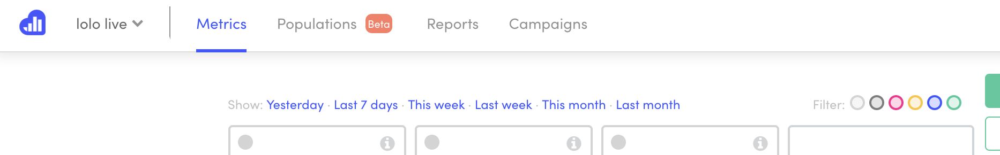
+ 현재 사용하는 것은 Metrics와 Reports
    - Metrics: 특정 항목(Property) 또는 이벤트(Event)에 대한 간단한 수치적 통계를 만들수 있음. 예)기간별 특정 이벤트를 실행한 사용자수(또는 이벤가 실행된 횟수), 총 매출, 평균매출,  
    - Reports: 5가지 리포트를 이용하여 사용자의 유입경로, 홈페이지 내에서 행동경로, 이탈률 및 목표달성율, AB테스트 를 분석할 수 있음

### Funnel Reports를 이용한 마케팅이벤트 트래킹
(예, "무스텔라 론칭 기념 이벤트" 페이지를 방문한 유저중 실제로 구매까지 이어지는 Funnel)
+ Funnel Reports: 사용자 지정 흐름에 따라 이벤트 단계별 이탈률, 목적달성률을 볼수 있는 Report
+ 상단 메뉴 바 에서 reports클릭
+ All Reports페이지에서 Funnel Reports를 클릭
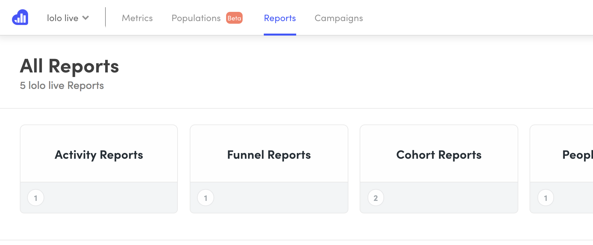

+ Funnel Reports페이지 에서 오른쪽 상단에 녹색버튼인 Create Funnel Report클릭
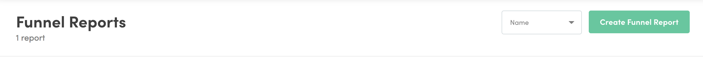

+ 상단에 Name your report에 해당 Funnel report 의 이름을 입력
+ Add your first step 버튼을 눌러 Funnel의 첫번째 단계(step)을 설정(Edit Funnel Report영역의 Funnel Steps부분)
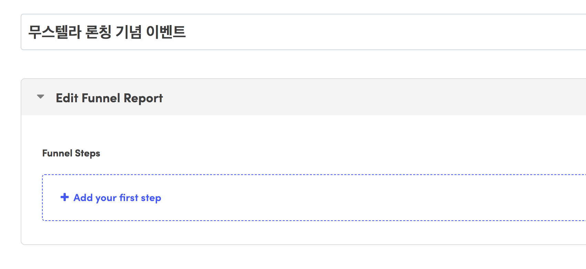

+ 단계설정 영역 첫번째 칸에서 "Has done event"를 선택, "무스텔라 론칭 기념 이벤트"페이지에 방문한 유저들을 트래킹 할 수 있도록 두번째칸에서 event 선택 중 "Into event"를 선택, 1번이상 방문한 유저 대상임으로 세번째 설정을 "at least"로, 네번째 설정을 "1 time"으로 함

+ 모든 마케팅 이벤트 페이지 방문이 아닌 "무스텔라 론칭 기념 이벤트"페이지 방문자만 해당됨으로 네번째 설정칸 "1 time" 옆의 ">"기호 버튼을 눌러 추가적으로 property를 설정할 수 있는 영역 오픈
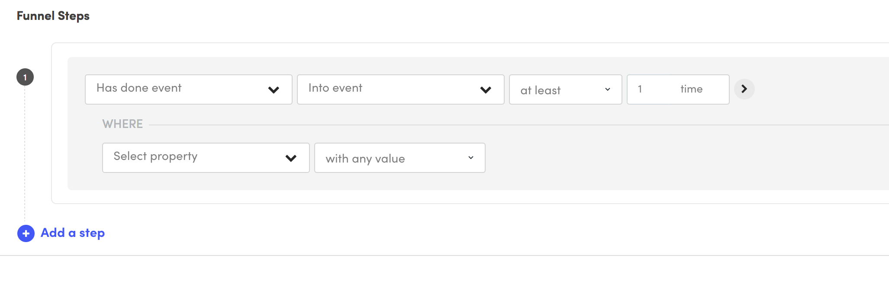

+ Select property칸에서 마케팅이벤트 이름으로 선택할 수 있는 property인 "Into event title"를 선택
+ 두번째 설정칸에 "containing"선택시 세번째 설정칸 생성. 세번째 설정칸에 "Into event title"값으로 저장된 이벤트 제목들중 "무스텔라 론칭 기념 이벤트" 선택
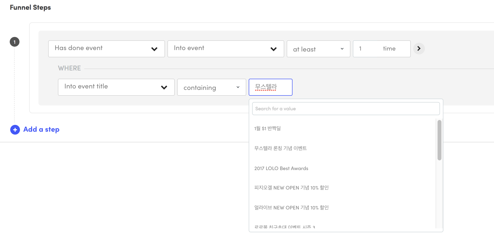

+ 하단의 Add a step 버튼을 눌러 Funnel의 다음 step(단계) 설정
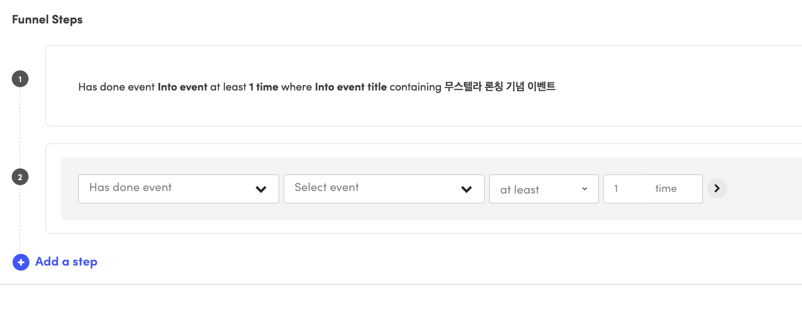

+ "무스텔라 론칭 기념 이벤트"페이지를 보고 실제 상품페이지인 "[무스텔라] 건성피부 영양가득 3종 세트"에 방문한 유저수를 알아보기 위해 event를 "Into product", property를 "Into product"로 설정(상품페이지가 워낙많아 "Into product name"으로는 검색이 힘듬). "[무스텔라] 건성피부 영양가득 3종 세트"상품 아이디 인 2800을 입력
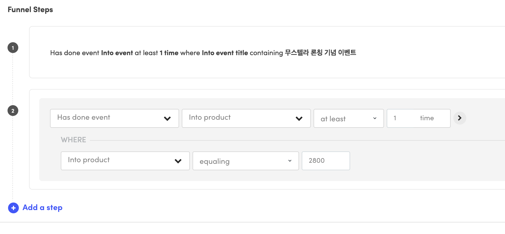

+ 우측상단의 "Run report"버튼클릭시 첫번째 리포트 결과 페이지 생성. "Run report"버튼의 밑 부분에서 기간을 자유롭게 설정할 수 있으며 좌측 "Save report"버튼을 눌러 해당 Funnel설정을 저장 할 수 있음
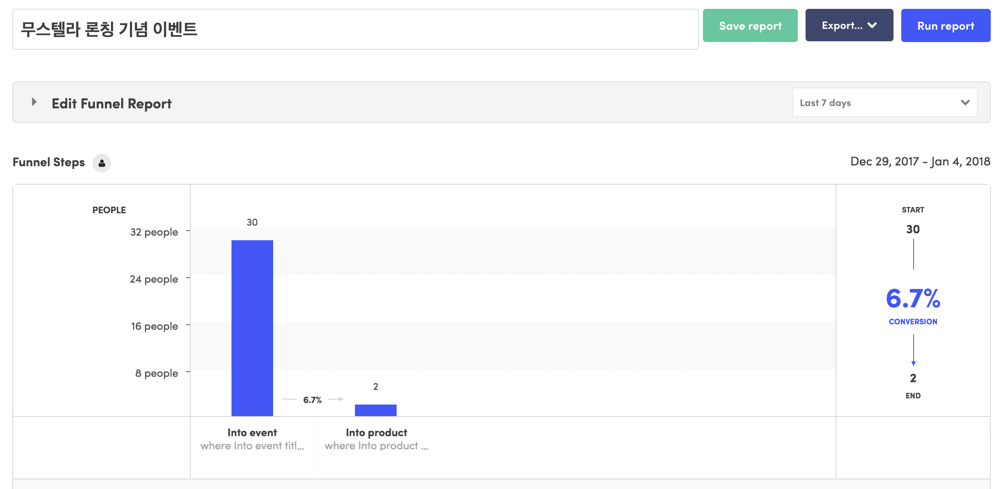

+ "무스텔라 론칭 기념 이벤트"페이지 방문자 중 "[무스텔라] 건성피부 영양가득 3종 세트" 상품페이지 방문자 외에 "[무스텔라] 극건성 피부진정 3종 세트"와 "[무스텔라] 임산부 선물 3종 세트" 상품페이지까지 3개의 상품페이지중 적어도 하나의 상품페이지의 방문자를 알아보기위에 "Funnel name" 밑의 "Edit Funnel Report"를 클릭
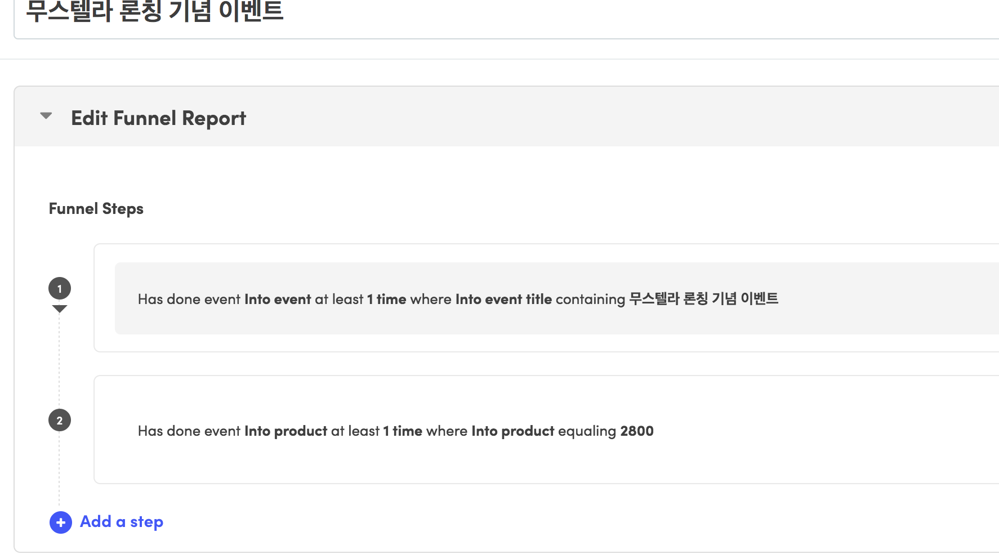

+ 2번째 스탭을 마우스hover할 경우 우측에 보이는 2개 버튼중 첫번째인 "Add additional condition to step"을 선택. condition을 "OR". 밑의 설정창에서 "Into product" event의 "Into product"값을 "[무스텔라] 극건성 피부진정 3종 세트"인 2801로 설정
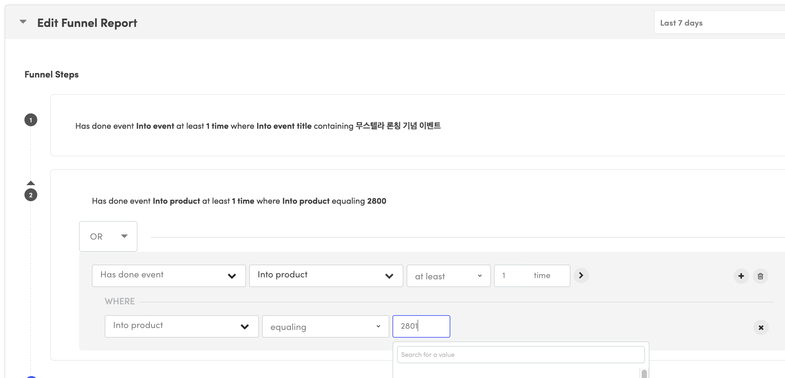

+ 같은 방법으로 "[무스텔라] 임산부 선물 3종 세트"를 추가하고 "Run Report"실행시
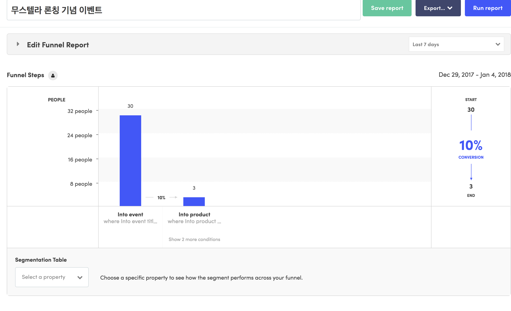
+ 현재까지 완성된 스탭을 "Edit Funnel Report"를 클릭하여 확인
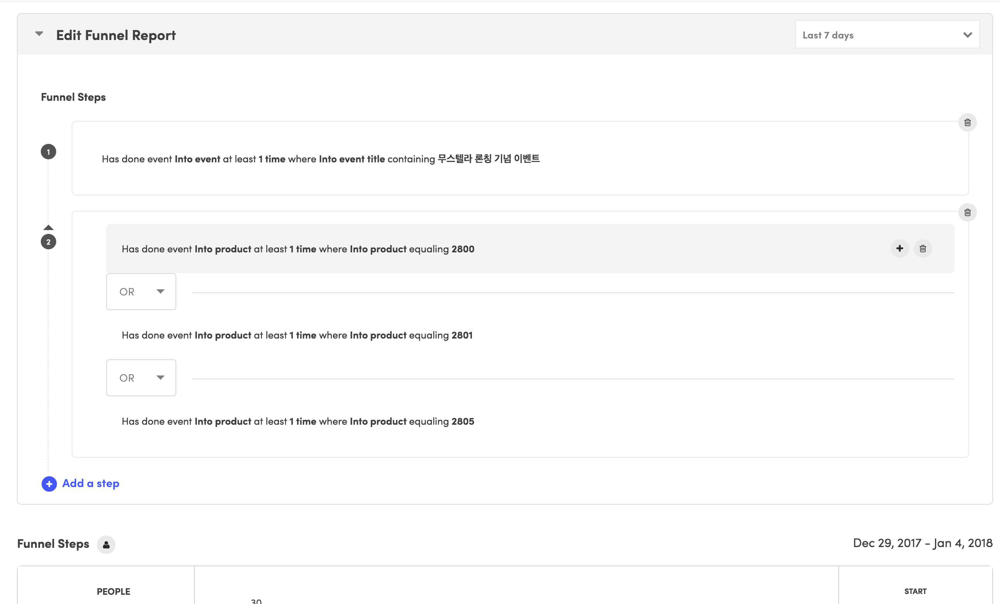

+ 구매로 이어지는 step(단계)을 추가하기 위해 "Edit Funnel Report"에서 "Add a step"을 클릭
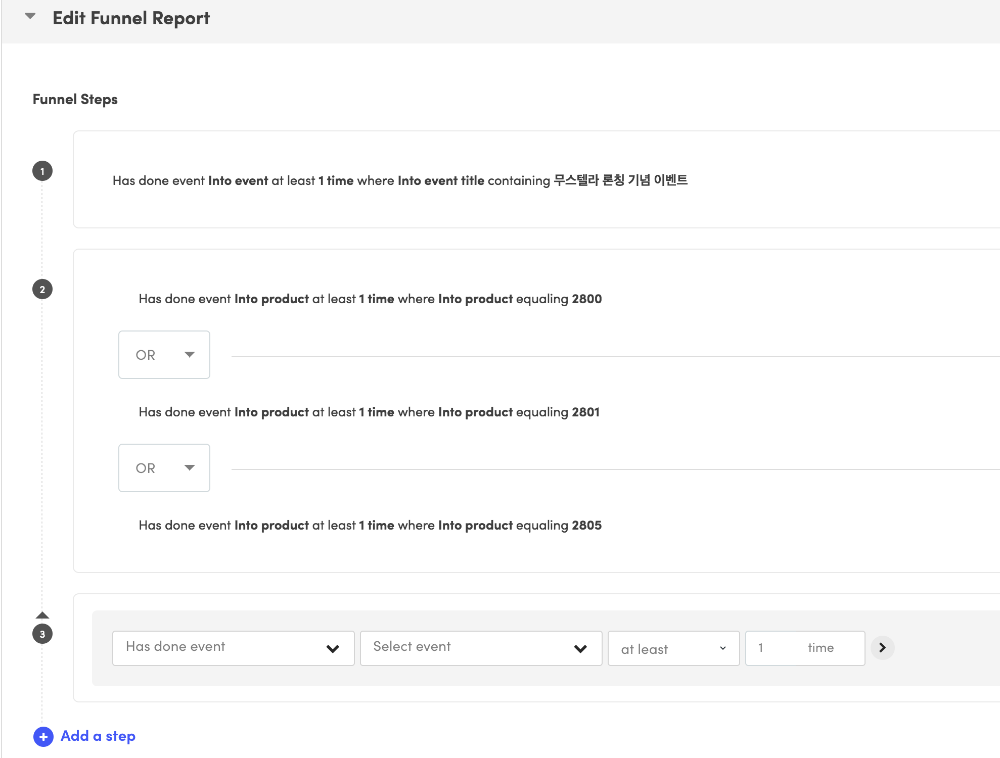

+ event명을 "Ordered product"로 property명을 "Ordered Product"로 하여 "[무스텔라] 건성피부 영양가득 3종 세트"상품값인 2800을 입력
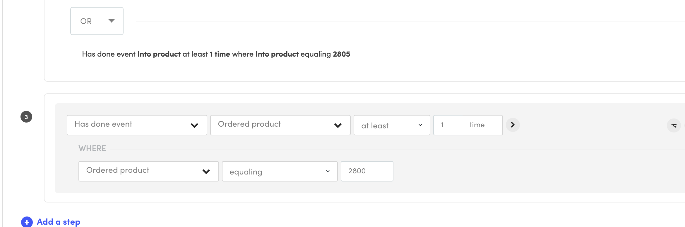

+ 2단계에서 condition을 추가했던 방식으로 "[무스텔라] 극건성 피부진정 3종 세트"와 "[무스텔라] 임산부 선물 3종 세트"상품의 구매여부를 확인하기 위해 추가
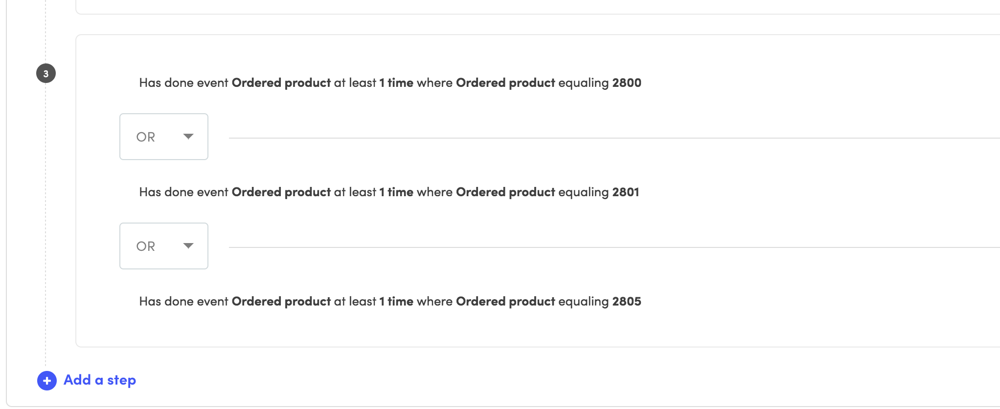

+ "Run report"실행 결과 페이지
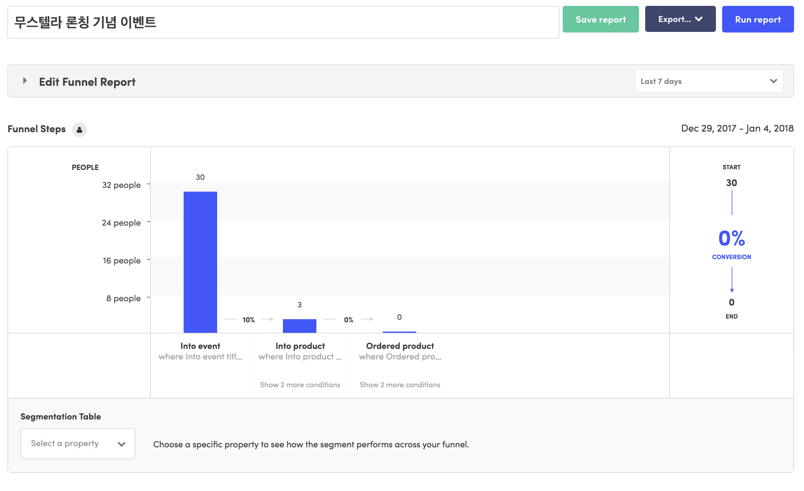
